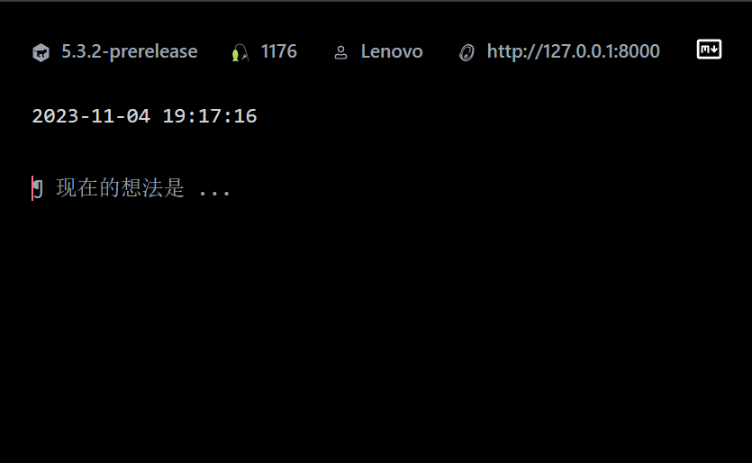

# usewiki

> [!IMPORTANT]
> 目前仅针对无需要的nodejs tiddlywiki实例, 暂未支持需要验证

> 不用仅仅为了记录一个临时想法,浪费额外的几秒去打开太微(TiddlyWiki), 借助usewiki(chrome extension for tiddlywiki), 你可以立刻将你的想法记录下来.

## TODO

- 重构状态管理, 数据持久化(也许chrome extension 可以使用background.js)
- add contentmenu
- add user configuration
- filetype: md/tid(default)
- support dark/light mode switch(with tailwindcss)
- revison field 利用
- journal 聚合到一个tiddler
- input 支持换行
- add tag ui
- 绑定触发快捷键

## Links

- https://juejin.cn/post/7138820996840030215
- https://juejin.cn/post/7257520279312498748

## Download

- https://github.com/oeyoews/usewiki/releases

## Credits

- 灵感来自 usememos 的 chrome 扩展, 由于 usememos 扩展使用 Vanilla Js + Lib, 没有使用框架, 所以只有UI借鉴.
- usewiki 使用 plasmo (扩展界的Next.js)框架 编写. 技术栈有React + Typescript +Tailwindcss.
