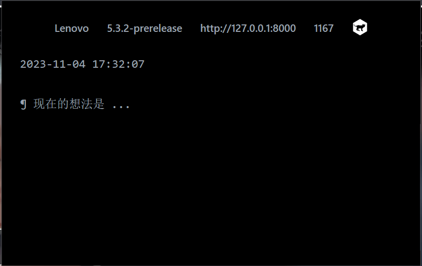

# usewiki

> [!IMPORTANT]
> beta

> 不用仅仅为了记录一个临时想法,浪费额外的几秒去打开太微(TiddlyWiki), 借助usewiki(chrome extension for tiddlywiki), 你可以立刻将你的想法记录下来.

## Dev

```bash
pnpm create plasmo --with-tailwindcss(似乎命令不能用)
```

## Links

- https://juejin.cn/post/7138820996840030215
- https://juejin.cn/post/7257520279312498748

## TODO

- add contentmenu
- add user configuration
- filetype: md/tid(default)
- support dark/light mode switch(with tailwindcss)
- UI 暂时不处理, 先加功能
- revison field 利用
- journal 聚合到一个tiddler
- https://blog.csdn.net/weixin_42981560/article/details/115701565 上架谷歌商店支付似乎很麻烦?
- 中文输入bug(onchange)

## NOTE

- 打包的时候会有网络请求, 如果无网络, 打包会失败

## Credits

- 灵感来自 usememos 的 chrome 扩展, 由于 usememos 扩展使用 Vanilla Js + Lib, 没有使用框架, 所以只有UI借鉴.
- usewiki 使用 plasmo (扩展界的Next.js)框架 编写. 技术栈有React + Typescript +Tailwindcss.
